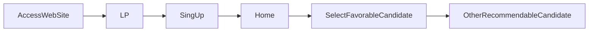
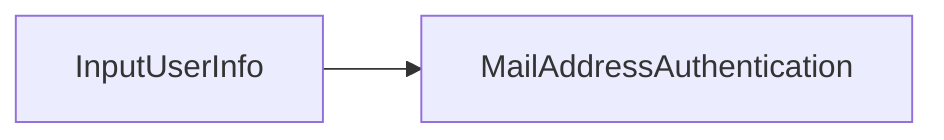
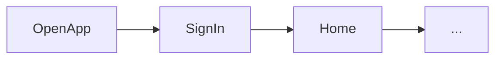
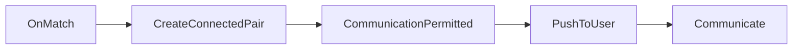
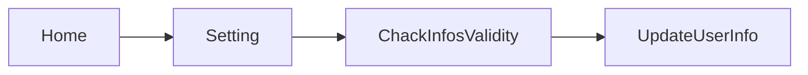

# UXとロジック
というかアプリ使用の流れ

- 初回時

```mermaid
graph LR
AccessWebSite-->LP-->SingUp-->Home
Home-->SelectFavorableCandidate-->OtherRecommendableCandidate
```

- SignUp詳細

```mermaid
graph LR
InputUserInfo-->MailAddressAuthentication
```
電話番号とかの方がいいかもしれないけど最初はより気軽に登録できるメールアドレスで認証する。
免許証とかも画像確認できるようにしたい(最初は人力)

- ２回目以降

```mermaid
graph LR
OpenApp-->SignIn-->Home-->...
```

- マッチしたとき

```mermaid
graph LR
OnMatch-->CreateConnectedPair-->CommunicationPermitted-->PushToUser-->Communicate
```

- ユーザ情報/設定変更

```mermaid
graph LR
Home-->Setting-->ChackInfosValidity-->UpdateUserInfo
```
